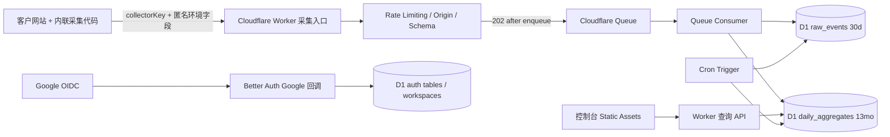

# Browser Pulse 产品定义（MVP）

- 状态：可进入技术方案拆解
- 版本：1.0
- 日期：2026-08-02
- 首发语言：简体中文
- 目标技术栈：Cloudflare Workers 全栈

## 1. 产品定义

**Browser Pulse（浏览器脉搏）**是一款面向前端、QA 和技术产品团队的开发者 SaaS：以最少的匿名浏览器环境数据，展示真实页面加载样本的浏览器主版本分布、变化趋势和低于最低支持线的样本占比，帮助团队决定浏览器兼容范围、测试矩阵和升级提示覆盖范围。

核心结果只有三类：

1. 浏览器家族与主版本分布；
2. 日、周、月变化趋势；
3. 低于客户所设最低支持主版本的样本占比。

Browser Pulse 不识别同一终端访客。产品只能使用“采集事件数”“页面加载样本数”和“样本占比”，不得使用“用户数”“访客数”“UV”或“去重人数”。

### 1.1 本次需求中的“用户标识”

“采集代码上传时标明数据是哪个用户的”落实为：**标明事件属于哪个 Browser Pulse 租户和项目，而不是标记访问客户网站的终端访客。**

Google 登录账号是操作人；工作区是数据租户；项目是数据归属单元。接入代码携带项目的公开 `collectorKey`，服务端将其解析为唯一的 `workspaceId` 和 `projectId`。接入代码不发送 Google `sub`、邮箱、内部账号 ID 或访客 ID。

这是一个有意的职责分离：MVP 虽然只有“一个登录账号 → 一个工作区 → 多个项目”，事件仍归属于项目而非操作人；以后扩展账号或成员模型时，无需迁移采集数据的归属语义。

## 2. 用户与核心任务

| 角色           | 核心任务                                 |
| -------------- | ---------------------------------------- |
| 前端负责人     | 决定最低支持版本、降级策略和升级提示范围 |
| QA/测试负责人  | 按真实版本占比维护浏览器测试矩阵         |
| 技术产品负责人 | 评估停止支持旧版本的影响范围             |

MVP 账号边界：

- 面向由一名负责人操作 Browser Pulse 的小团队；一个 Google 登录账号最多创建并管理一个工作区；
- 工作区下可创建多个项目，控制台不提供工作区切换；
- 暂不提供成员邀请、加入其他工作区、角色划分或权限委派；协作成员体系留待后续版本单独设计。

## 3. MVP 范围

### 3.1 包含

- Google 登录；
- 一个登录账号、一个工作区及其下的多个项目；
- 每个项目生成唯一、可轮换的公开采集标识 `collectorKey`；
- 控制台生成的显式调用浏览器采集代码片段；
- 浏览器事件采集 API；
- 聚合查询 API；
- 浏览器版本分布、趋势和最低支持线看板；
- 原始匿名事件 30 天、每日聚合 13 个月的保留策略；
- 项目停用、密钥吊销和项目数据删除。

### 3.2 不包含

- 终端访客 ID、跨页面或跨站识别；
- 浏览器指纹、用户画像、会话回放；
- 反欺诈、实时访问拦截；
- 错误监控、性能监控或完整设备分析；
- 逐事件查询或导出；
- Google 之外的登录方式；
- 成员邀请、加入其他工作区、多工作区切换和 Owner/Admin/Viewer 角色体系；
- 计费、套餐和用量结算。

## 4. 账号、租户与标识模型

| 标识           | 生成方        | 用途                                                      | 是否进入接入代码/浏览器事件 |
| -------------- | ------------- | --------------------------------------------------------- | --------------------------- |
| Google `sub`   | Google        | 绑定 Google 登录身份；稳定主键，不使用邮箱作主键          | 否                          |
| `userId`       | Browser Pulse | 内部操作人 ID                                             | 否                          |
| `workspaceId`  | Browser Pulse | 内部租户 ID                                               | 否                          |
| `projectId`    | Browser Pulse | 内部项目 ID；聚合查询路径使用                             | 否                          |
| `collectorKey` | 工作区所有者  | 公开、写入专用、可轮换的项目采集标识，示例 `bpc_live_...` | 是                          |
| `queryApiKey`  | 工作区所有者  | 服务端聚合只读密钥，示例 `bpq_live_...`                   | 否                          |
| `visitorId`    | 不生成        | 明确禁止                                                  | 否                          |

约束：

- 首次 Google 登录只创建或绑定内部 `userId`；登录后用户显式填写工作区名称并创建工作区。`workspaces.ownerUserId` 必须唯一，重复提交不能创建第二个工作区。
- `accountId` 如需在账号设置中展示，只能作为内部客服/审计标识，不作为浏览器写入凭证。
- `collectorKey` 至少使用 128 位随机熵，全球唯一。它会公开在客户网页中，因此不是秘密，也不能提供读取权限。
- 工作区所有者可创建、命名、轮换和立即吊销 `collectorKey`；轮换时可短暂并存新旧键，旧键在确认后失效。
- `queryApiKey` 只在创建时显示一次明文，服务端仅保存不可逆摘要；不得出现在浏览器代码中。
- 数据归属链固定为 `collectorKey -> projectId -> workspaceId`，客户端不能在正文中覆盖 `projectId` 或 `workspaceId`。

## 5. Google 登录合同（Better Auth）

Browser Pulse 通过 Better Auth 的 Google social provider 接入登录。Better Auth 负责 OAuth/OIDC 协议、账号绑定和会话生命周期；应用层只消费已验证的 `userId`，不得另写一套 OAuth 回调或会话实现。

### 5.1 请求、回调与账号绑定

- 只启用 Google 登录，关闭邮箱密码和其他 social provider，并设置 `account.accountLinking.enabled=false`；
- `baseURL` 固定为生产 HTTPS 域名，Google Console 精确登记 Better Auth 的 `/api/auth/callback/google` 回调地址，禁止通配回调；
- 最小 scope 为 `openid email profile`；
- Better Auth 服务端执行 Authorization Code Flow，生成并校验 `state` 与 PKCE；OAuth state 使用 D1 verification 记录保存，回调完成后立即失效；
- ID Token 的签名、`iss`、`aud` 和 `exp` 等校验由 Better Auth Google provider 完成，应用层不得信任未经 Better Auth 验证的 profile 或 token；
- 外部身份唯一键为 `providerId=google` 与 `accountId=Google sub` 的组合。邮箱和展示资料可以更新，但不得按邮箱合并账号、查找工作区或改变所有权；邮箱相同但 `sub` 不同的登录必须拒绝并进入人工处理，而不是复用原账号；
- 产品不调用其他 Google API，不设置离线访问，也不主动请求 refresh token；身份绑定完成后不保留 Google access token、ID Token 或 refresh token；
- Google Client ID 作为 Worker 环境配置；Google Client Secret 和 Better Auth secret 仅放入 Workers Secrets。三者均不得写入代码仓库或静态资源，两个 secret 不得进入浏览器响应。

### 5.2 D1 会话与工作区创建

- Better Auth 的 user、account、session、verification 逻辑表落在 D1；应用表通过 Better Auth `user.id` 作为 `userId` 外键；
- 会话 Cookie 必须为 `HttpOnly; Secure; SameSite=Lax; Path=/`，且只发送到 Browser Pulse 控制台域名；
- 关闭 Better Auth session cookie cache；受保护请求每次根据 D1 session 记录校验会话，以保证退出登录和吊销立即生效；
- 退出登录调用 Better Auth 的 sign-out/会话吊销能力；Google 账号后续安全状态等上游事件不在 MVP 自动同步范围内；
- 登录成功但尚无工作区时，控制台只展示工作区创建页。创建接口以 `ownerUserId` 唯一约束保证幂等；创建成功后才能进入项目页面；
- 已有工作区的账号直接进入该工作区，不显示邀请入口或工作区选择器；
- Google 登录 Cookie 仅用于 Browser Pulse 控制台，不进入客户网站的采集代码。

## 6. 主流程

1. 用户点击“使用 Google 登录”，由 Better Auth 完成 Google 回调并建立 D1 会话。
2. 首次登录只创建账号；用户填写工作区名称后创建唯一工作区，后续登录直接进入该工作区。
3. 用户在工作区下创建项目，填写项目名、允许接入的生产/测试 Origin；项目时区固定为 `Asia/Shanghai`。
4. 系统生成公开 `collectorKey` 和服务端 `queryApiKey`。
5. 用户从控制台复制项目专属的内联采集代码片段，并在自己的隐私告知或同意流程完成后显式调用 `collectBrowserPulse()`。
6. 代码片段在当前页面本地识别最小浏览器环境字段，携带 `collectorKey` 发送一次事件。
7. 采集 Worker 校验键、Origin、正文、额度和速率限制，成功进入队列后返回 `202`。
8. 队列消费者写入 30 天原始事件并更新每日聚合；5 分钟内看板和聚合 API 可见。
9. 用户为各浏览器家族配置最低支持主版本；系统即时重算低于支持线的样本占比。

空项目不展示空图表，而展示接入代码、Origin 配置检查和服务端最近一次可观测的拒绝原因。客户端网络失败只能由 `collectBrowserPulse()` 的返回值表达，后台不得伪称可观测。

## 7. 接入代码片段合同

Browser Pulse 不发布 npm 包、远程 JS SDK 或需要额外下载的运行时。项目接入设置生成一段可复制、无外部依赖的内联代码，其中已写入项目 `collectorKey` 和实际采集域名。以下为格式示例：

```html
<script>
  const collectBrowserPulse = (() => {
    let firstRequest

    const firstMatch = (value, rules) => {
      for (const [pattern, family] of rules) {
        const matched = value.match(pattern)
        if (matched) return { family, major: matched[1] || null }
      }
      return null
    }

    const detect = () => {
      const ua = navigator.userAgent || ''
      const uaData = navigator.userAgentData
      let browser = null
      let detectionSource = 'unknown'

      if (uaData?.brands) {
        const brandRules = [
          [/Microsoft Edge/i, 'Edge'],
          [/\bOpera\b/i, 'Opera'],
          [/Google Chrome/i, 'Chrome'],
          [/\bChromium\b/i, 'Chrome'],
        ]
        for (const [pattern, family] of brandRules) {
          const brand = uaData.brands.find((item) => pattern.test(item.brand))
          if (brand) {
            browser = {
              family,
              major: /^\d+/.exec(String(brand.version))?.[0] || null,
            }
            detectionSource = 'ua_ch'
            break
          }
        }
      }

      if (!browser) {
        browser = firstMatch(ua, [
          [/SamsungBrowser\/(\d+)/, 'Samsung Internet'],
          [/Edg(?:A|iOS)?\/(\d+)/, 'Edge'],
          [/OPR\/(\d+)/, 'Opera'],
          [/CriOS\/(\d+)/, 'Chrome'],
          [/Chrome\/(\d+)/, 'Chrome'],
          [/FxiOS\/(\d+)/, 'Firefox'],
          [/Firefox\/(\d+)/, 'Firefox'],
          [/Version\/(\d+).+Safari\//, 'Safari'],
        ])
        if (browser) detectionSource = 'user_agent_fallback'
      }

      const touchMac = /Macintosh/.test(ua) && Number(navigator.maxTouchPoints) > 1
      const platform = String(uaData?.platform || '').toLowerCase()
      const platformFamilies = {
        windows: 'Windows',
        macos: 'macOS',
        ios: 'iOS',
        android: 'Android',
        linux: 'Linux',
        'chrome os': 'ChromeOS',
      }
      let osFamily = platformFamilies[platform]
      if (!osFamily) {
        if (/iPhone|iPad|iPod/.test(ua) || touchMac) osFamily = 'iOS'
        else if (/Android/.test(ua)) osFamily = 'Android'
        else if (/Windows NT/.test(ua)) osFamily = 'Windows'
        else if (/CrOS/.test(ua)) osFamily = 'ChromeOS'
        else if (/Macintosh|Mac OS X/.test(ua)) osFamily = 'macOS'
        else if (/Linux/.test(ua)) osFamily = 'Linux'
        else osFamily = ua || platform ? 'Other' : 'Unknown'
      }

      let deviceClass = 'Unknown'
      if (/iPad/.test(ua) || touchMac || (/Android/.test(ua) && !/Mobile/.test(ua))) {
        deviceClass = 'Tablet'
      } else if (uaData?.mobile || /iPhone|iPod|Android.+Mobile|Mobile/.test(ua)) {
        deviceClass = 'Mobile'
      } else if (['Windows', 'macOS', 'Linux', 'ChromeOS'].includes(osFamily)) {
        deviceClass = 'Desktop'
      } else if (ua || platform) {
        deviceClass = 'Other'
      }

      return {
        browserFamily: browser?.family || 'Unknown',
        browserMajor: browser?.major || null,
        osFamily,
        deviceClass,
        detectionSource,
        snippetVersion: '1.0.0',
      }
    }

    return function collectBrowserPulse() {
      if (firstRequest) return firstRequest
      firstRequest = fetch(
        'https://collector.browserpulse.example/v1/browser-events/bpc_live_...',
        {
          method: 'POST',
          headers: { 'Content-Type': 'text/plain;charset=UTF-8' },
          body: JSON.stringify(detect()),
          keepalive: true,
        },
      )
        .then((response) => {
          if (response.status === 202) return { status: 'accepted' }
          const reasonByStatus = {
            400: 'invalid_payload',
            401: 'invalid_key',
            403: 'origin_not_allowed',
            413: 'invalid_payload',
            429: 'rate_limited',
          }
          return {
            status: 'rejected',
            reason: reasonByStatus[response.status] || 'server_error',
          }
        })
        .catch(() => ({ status: 'rejected', reason: 'network_error' }))
      return firstRequest
    }
  })()
</script>
```

站点只在自身同意流程允许后调用：

```js
const result = await collectBrowserPulse()
```

返回值合同：

```ts
Promise<{
  status: 'accepted' | 'rejected'
  reason?:
    | 'invalid_payload'
    | 'invalid_key'
    | 'origin_not_allowed'
    | 'rate_limited'
    | 'server_error'
    | 'network_error'
}>
```

行为约束：

- 代码片段只定义函数，不自动采集；未获得同意时，站点不调用该函数；
- 每次页面加载最多发送一个事件，同页重复调用返回同一个 Promise，不得重复计数；
- 不自动重试，避免页面关闭和队列重试共同造成重复样本；
- 跨页面同意/撤回状态由接入站点保存；片段不提供持久化状态或 `disable()` API；
- 采集失败通过返回值表达，不向宿主页面抛出未捕获异常；
- 代码内联执行，无额外脚本下载，不阻塞首屏，不注入第三方 Cookie 或稳定标识；
- 片段在客户端完成 UA-CH/UA 归一化，原始 User-Agent 只在页面内存中短暂读取，不进入请求正文；
- 控制台生成的片段必须完整复制即可使用；`snippetVersion` 采用语义化版本，用于区分识别规则，不作为访客标识。

## 8. 数据字典与识别规则

每个被接受的事件只保留下列业务字段：

| 字段              | 规则                                                                                   |
| ----------------- | -------------------------------------------------------------------------------------- |
| `projectId`       | 服务端由 `collectorKey` 解析，不接受客户端指定                                         |
| `collectedAt`     | 服务端接收时间，UTC 存储                                                               |
| `browserFamily`   | `Chrome \| Edge \| Firefox \| Safari \| Opera \| Samsung Internet \| Other \| Unknown` |
| `browserMajor`    | 十进制主版本字符串；不能可靠判断时为 `null`                                            |
| `osFamily`        | `Windows \| macOS \| iOS \| Android \| Linux \| ChromeOS \| Other \| Unknown`          |
| `deviceClass`     | `Desktop \| Mobile \| Tablet \| Other \| Unknown`                                      |
| `detectionSource` | `ua_ch \| user_agent_fallback \| unknown`                                              |
| `snippetVersion`  | 控制台生成片段的语义化版本                                                             |

识别规则：

- 优先使用低熵 `navigator.userAgentData`；不支持时回退到传统 User-Agent；
- UA-CH `brands` 可能包含 GREASE/伪品牌，不得直接取数组第一项；
- 只保留主版本，不请求 `fullVersionList`、精确系统版本、架构或设备型号等高熵字段；
- 无法可靠识别时保留 `Other` 或 `Unknown`，不得猜测；
- 看板始终展示 `Unknown` 占比和 `detectionSource` 覆盖情况。

禁止进入分析存储、队列死信正文或应用事件日志的字段：原始 User-Agent、完整浏览器版本、IP 地址、页面 URL/路径、Referrer、语言、时区、屏幕尺寸、设备型号、架构、Cookie、本地存储 ID、客户业务用户 ID，以及任何稳定或跨站访客标识。

Cloudflare 边缘层不可避免会短暂处理 IP 和 User-Agent 请求头。应用日志必须关闭请求头和请求正文记录；边缘安全日志与分析数据隔离，采用最短可行保留期，且不得用于产品统计。

## 9. 采集 API

### 9.1 请求

```http
POST /v1/browser-events/{collectorKey}
Content-Type: text/plain;charset=UTF-8
Origin: https://allowed.example
```

正文是 JSON 编码文本：

```json
{
  "browserFamily": "Chrome",
  "browserMajor": "140",
  "osFamily": "Windows",
  "deviceClass": "Desktop",
  "detectionSource": "ua_ch",
  "snippetVersion": "1.0.0"
}
```

- 控制台生成的浏览器代码片段使用 `text/plain;charset=UTF-8`，不添加自定义鉴权头，以避免 CORS 预检并兼容 `fetch(..., { keepalive: true })`；
- 直接 HTTP 客户端可用 `application/json`，但也必须显式提供白名单内的 `Origin`。`Origin` 可伪造，因此该能力不改变“客户端最佳努力样本”的信任边界；
- 正文最大 1 KB；未知字段拒绝，枚举和版本格式必须严格校验；
- `collectorKey` 是公开写入标识，不提供读取能力。

### 9.2 响应

| 状态           | 含义                                                        |
| -------------- | ----------------------------------------------------------- |
| `202 Accepted` | 请求已通过校验并成功进入 Cloudflare Queue；不代表聚合已完成 |
| `400`          | 载荷或字段无效                                              |
| `401`          | `collectorKey` 无效或已吊销                                 |
| `403`          | `Origin` 缺失或不在项目白名单                               |
| `413`          | 正文超过 1 KB                                               |
| `429`          | 项目额度或速率限制                                          |

- 采集端点不接受 Cookie 或其他浏览器凭证；对带有合法格式 `Origin` 的请求，成功和失败响应均精确回显 `Access-Control-Allow-Origin: <Origin>` 并返回 `Vary: Origin`，但不得返回 `Access-Control-Allow-Credentials`。该响应头只让代码片段读取状态，不能替代项目 Origin 白名单校验。

成功响应不返回事件明细。Worker 为队列消息生成一次性 `ingestId`；消费者按该 ID 幂等写入，防止 Queue 重投导致聚合重复。`ingestId` 不来自浏览器、不跨页面复用，也不用于访客识别。

域名校验、不可枚举的高熵 `collectorKey`、项目级 Rate Limiting 和请求大小限制只用于降低滥用，不承诺防止伪造 Origin 或伪造事件。统计结果不能用于安全鉴权或反欺诈。

## 10. 聚合查询 API

```http
GET /v1/projects/{projectId}/browser-version-distribution
Authorization: Bearer bpq_live_...
```

查询参数：

- `from`：RFC 3339，包含；
- `to`：RFC 3339，不包含；
- `interval=day|week|month`；
- 可重复的 `osFamily` 和 `deviceClass`；
- 未传时间时默认最近 30 个完整自然日；最长跨度 13 个月；
- UTC 存储，按项目固定时区 `Asia/Shanghai` 分桶和展示。

响应顶层字段：

```ts
{
  projectId: string
  from: string
  to: string
  timezone: 'Asia/Shanghai'
  totalEvents: number
  identifiableEvents: number
  policyEligibleEvents: number
  belowSupportEvents: number
  belowSupportRate: number | null
  unknownRate: number
  distribution: Array<{
    browserFamily: string
    browserMajor: string | null
    eventCount: number
    share: number
    minimumSupportedMajor: string | null
    status: 'supported' | 'below_support' | 'unconfigured' | 'unknown'
  }>
  trend: Array<{
    start: string
    eventCount: number
    policyEligibleEvents: number
    belowSupportEvents: number
    belowSupportRate: number | null
  }>
}
```

指标公式：

- `share = eventCount / totalEvents`；
- `unknownRate = 浏览器家族或主版本不可识别的事件数 / totalEvents`；
- `policyEligibleEvents` 只包含“家族已配置支持线且主版本可识别”的事件；
- `belowSupportRate = belowSupportEvents / policyEligibleEvents`；
- 分母为零时 `belowSupportRate = null`，不得返回 `0`。

接口只返回聚合结果，不提供逐事件 API。`distribution` 按 `share` 降序，不分页。超过 13 个月、`from >= to` 或筛选枚举无效返回 `400`；无权访问项目返回 `403`；项目不存在返回 `404`。

所有端点使用 `/v1`。字段仅允许向后兼容新增；删除字段或改变语义必须进入新路径版本。查询密钥支持创建、命名、轮换和立即吊销。

## 11. 看板信息架构

项目概览固定包含：

1. 采集事件总数；
2. 可识别浏览器主版本的样本占比；
3. 支持策略覆盖率，即 `policyEligibleEvents / totalEvents`；
4. 低于支持线的样本占比；
5. 最近成功采集时间。

视图：

- **版本分布**：按“浏览器家族 → 主版本”展开，显示事件数、占比和策略状态；`Unknown` 单列；
- **趋势**：日/周/月变化；
- **筛选**：日期、操作系统家族、设备类型；所有筛选同时作用于概览、分布和趋势；
- **支持策略**：每个已识别浏览器家族可设置整数主版本阈值；未配置家族不进入策略分母；修改阈值后按现有聚合立即重算，不改写历史事件；
- **接入设置**：Origin 白名单、项目专属代码片段、采集键与查询键管理、最近拒绝原因；
- **工作区设置**：工作区名称和删除操作；MVP 不展示成员、邀请、角色或工作区切换入口。

必须设计加载中、无数据、部分字段不可识别、策略分母为零、查询失败、超过保留期、权限不足和密钥已吊销状态。缺失样本不得被折算成零或“兼容”。相同参数下，看板结果必须与聚合 API 完全一致。

## 12. Cloudflare 实现基线

### 12.1 组件

| Cloudflare 组件         | 职责                                                                                            |
| ----------------------- | ----------------------------------------------------------------------------------------------- |
| Workers + Static Assets | 承载控制台静态资源、Better Auth Google 登录与回调、会话校验、采集 API、查询 API                 |
| D1                      | Better Auth 账号/会话、工作区、项目、Origin、密钥摘要、支持策略、30 天原始事件、13 个月每日聚合 |
| Queues                  | 将采集响应与持久化解耦，批量消费、重试和削峰                                                    |
| Cron Triggers           | 每日保留期清理、聚合修复、密钥/会话到期清理                                                     |
| Rate Limiting binding   | 按 `collectorKey` 和路由限制采集/查询速率                                                       |
| Workers Secrets         | Google Client Secret、Better Auth secret、密钥摘要 pepper                                       |

MVP 不把 Workers KV、R2 或 Analytics Engine 作为事实源，避免同时维护第二套数据语义。达到 D1 容量或写入吞吐门槛后再单独评审存储迁移。



### 12.2 D1 逻辑表

- `users`、`accounts`、`sessions`、`verifications`：Better Auth 管理的账号、Google 身份绑定、会话和一次性 OAuth state；Google token 不作长期保存；
- `workspaces`：工作区名称、唯一 `ownerUserId`、创建/更新时间；MVP 不建 `memberships`；
- `projects`、`allowed_origins`：工作区下的项目及域名；
- `collector_keys`：采集键摘要、状态和轮换时间；
- `query_api_keys`：查询键摘要、名称、状态和最后使用时间；
- `support_policies`：浏览器家族与最低主版本；
- `raw_events`：服务端 `ingestId`、`projectId`、接收时间和最小数据字典；
- `daily_aggregates`：项目、上海自然日、筛选维度、版本维度和事件数。

队列消费者必须在同一幂等边界内完成“首次写入原始事件”和“聚合计数增加”。同一 `ingestId` 重投不能重复增加聚合。项目删除或停用后，消费者必须再次检查项目状态，丢弃仍在队列中的旧消息。

### 12.3 保留与删除

- `raw_events` 保留 30 天，仅用于重聚合和数据质量修复，控制台/API 不暴露；
- `daily_aggregates` 保留 13 个月，周/月结果由每日聚合计算；
- Cron 每日删除到期数据；队列死信若启用，只保存相同最小字段并采用不长于 7 天的保留期；
- 项目删除先吊销采集键、阻止新入队，再删除原始事件、聚合、Origin、策略和密钥；正常备份轮转中的副本在对外承诺的期限内清除；
- 如果 Cloudflare 实际备份机制不能满足“7 天内删除副本”，产品告知必须改为经法务确认、基础设施确实能兑现的周期，不能作虚假承诺。

## 13. 隐私与安全边界

- Google 账号资料和浏览器采集事件分表、分用途处理；事件表只引用 `projectId`，不引用 `userId`、Google `sub` 或邮箱；
- 内联采集代码不设置 Cookie、不写 Local Storage、不生成稳定访客标识；
- 客户作为其网站处理目的的决定方，应在自身隐私告知中说明目的、字段、方式、期限和权利路径；Browser Pulse 提供可复制字段清单和告知模板，但不替客户判断法律依据；
- 因无访客标识，系统无法定位某一自然人的单条匿名事件，产品必须如实告知这一限制；
- 若未来加入客户业务用户 ID、稳定访客 ID 或完整 UA，必须重新进行产品、安全和合规评审，不能复用现有字段静默上线；
- 依据《个人信息保护法》第六条、第七条、第十七条和第十九条执行最小必要、公开透明、处理前告知和最短保存期限原则；该约束不替代正式法律意见。

## 14. 中国大陆首发约束

当前 Cloudflare 方案定义为**Cloudflare 全球网络上的 MVP 基线**，不能同时宣称“数据保证存储在中国大陆”。这是上线前必须明确的边界：

- Cloudflare D1 当前公开的司法辖区约束只有 `eu` 和 `fedramp`；`apac` 只是位置提示，不保证具体位置，更不等于中国大陆数据驻留；
- Cloudflare China Network 是 Enterprise 单独订阅，接入域名需要有效 ICP 备案/许可；
- China Network 的公开可用产品列表列出 Workers、KV、R2、Assets、Rate Limiting 和 Secrets，但未明确列出 D1、Queues、Cron Triggers。未得到 Cloudflare 书面确认前，不得假设本基线能原样在中国网络内运行；
- Google 登录在中国大陆网络环境中的可达性和成功率是已知发布风险。MVP 按用户要求保留 Google-only 登录，但正式面向大陆客户前必须完成真实网络验收；失败时需要另立需求加入可在大陆稳定使用的登录方式；
- 若业务要求严格境内存储，应将 D1/Queues 替换为经确认的境内数据库与消息系统，并完成数据出境评估后再上线。该变更属于部署架构变体，不改变接入代码与聚合 API 的产品合同。

因此，“中国大陆优先”在当前版本表示中文产品和大陆开发者场景优先，不表示已经满足境内数据驻留或大陆网络可用性承诺。

## 15. 质量目标与产品指标

### 15.1 质量目标

- 新项目从看到接入代码到首个有效事件的中位时间不超过 5 分钟；
- 已接受事件进入聚合看板的延迟不超过 5 分钟；
- 看板与相同筛选条件的查询 API 事件数、占比完全一致；
- 单次采集正文不超过 1 KB；
- 内联采集代码按需执行、无额外脚本下载且不影响宿主页面；
- 同一页面重复调用最多计入一个事件；
- `Unknown`、解析来源和支持策略覆盖率始终可观察。

### 15.2 产品指标

- 成功收到事件的已创建项目比例；
- 每周查看版本分布或调整支持线的活跃项目数；
- 低于支持线报告被查看的项目比例；
- 从创建项目到首个有效事件的中位时间。

事件量只代表使用规模，不代表终端用户规模。

## 16. 发布验收

### 16.1 登录与租户

- 首次 Google 登录通过 Better Auth 创建或绑定一个用户，不自动创建工作区；相同 Google `sub` 的重复回调不重复创建用户；
- 登录后的工作区创建步骤最多创建一个工作区；重复提交不重复创建，已有工作区时直接进入；
- ID Token 校验失败、`state`/PKCE 不匹配或 redirect URI 不匹配均拒绝登录；
- Google `sub` 相同而邮箱变化时仍映射同一用户；邮箱相同但 `sub` 不同不得自动合并；
- 控制台不出现邀请、加入其他工作区、角色或工作区切换能力；
- 接入代码、队列和事件表中均不存在 `userId`、Google `sub`、邮箱或 `visitorId`。

### 16.2 采集

- 白名单 Origin 上的有效 `collectorKey` 返回 `202`，5 分钟内版本计数增加 1；
- Origin 缺失/不允许返回 `403`，无效/吊销键返回 `401`，超限返回 `429`；
- Chromium 使用 UA-CH；Safari/Firefox 使用 User-Agent 回退；不能可靠解析时进入 `Unknown`；
- 同页调用 `collectBrowserPulse()` 三次只增加 1 个事件；刷新两次后累计 3 个事件，界面不得称为 3 个用户；
- Queue 重投同一 `ingestId` 不重复增加原始事件或聚合；
- 客户端不发送原始 UA、IP、URL、Referrer 或稳定访客标识。

### 16.3 聚合与策略

- 同日期、系统和设备筛选下，看板与 API 完全一致；
- 只配置 Chrome 支持线时，Safari 不进入 `policyEligibleEvents`；
- 所有家族未配置时 `belowSupportRate = null`；
- 修改支持线后历史聚合即时重算，原始事件不改写；
- 查询密钥吊销后立即不能读取聚合；
- 30 天原始事件和 13 个月聚合按期删除；项目删除后新事件被拒绝，队列旧消息不会复活数据。

### 16.4 部署门槛

- Cloudflare 全球环境完成 Workers、Static Assets、D1、Queues、Cron、Rate Limiting 和 Secrets 的集成验证；
- 大陆真实网络完成 Google 登录、内联采集代码执行、采集 API 和控制台访问的成功率/延迟验收；
- 若宣称境内服务，必须完成 ICP、Cloudflare China Network 合同与具体产品可用性确认；
- 数据存储地点、跨境路径、日志和备份删除周期通过正式合规评审后才能写入对外承诺。

## 17. 版本成功定义

一个允许 Origin 上的 Chrome 页面在获得站点同意后显式调用内联 `collectBrowserPulse()`，函数返回 `accepted`，采集端点成功入队并返回 `202`，5 分钟内看板的 `Chrome/<主版本>` 样本数增加 1，聚合 API 在相同时间与筛选条件下也增加 1；全过程不下载额外 SDK、不创建访客 Cookie、不生成访客 ID、不保存原始 UA，也不暴露逐事件结果。该事件通过 `collectorKey` 归属于正确项目和工作区，但不能关联到某个网站访客。

## 18. 参考依据

- Cloudflare Workers Static Assets、D1、Queues、Cron、Rate Limiting 与 Secrets：<https://developers.cloudflare.com/workers/>
- Cloudflare D1 数据位置：<https://developers.cloudflare.com/d1/configuration/data-location/>
- Cloudflare China Network：<https://developers.cloudflare.com/china-network/>
- Cloudflare China Network 产品可用性：<https://developers.cloudflare.com/china-network/reference/available-products/>
- Google OpenID Connect：<https://developers.google.com/identity/openid-connect/openid-connect>
- Better Auth Google 登录：<https://www.better-auth.com/docs/authentication/google>
- Better Auth 数据库与会话：<https://www.better-auth.com/docs/concepts/database>、<https://www.better-auth.com/docs/concepts/session-management>
- MDN `navigator.userAgentData`：<https://developer.mozilla.org/en-US/docs/Web/API/Navigator/userAgentData>
- MDN User-Agent Client Hints：<https://developer.mozilla.org/en-US/docs/Web/API/User-Agent_Client_Hints_API>
- MDN User-Agent reduction：<https://developer.mozilla.org/en-US/docs/Web/HTTP/Guides/User-agent_reduction>
- 《中华人民共和国个人信息保护法》：<https://www.npc.gov.cn/npc/c2/c30834/202108/t20210820_313088.html>
